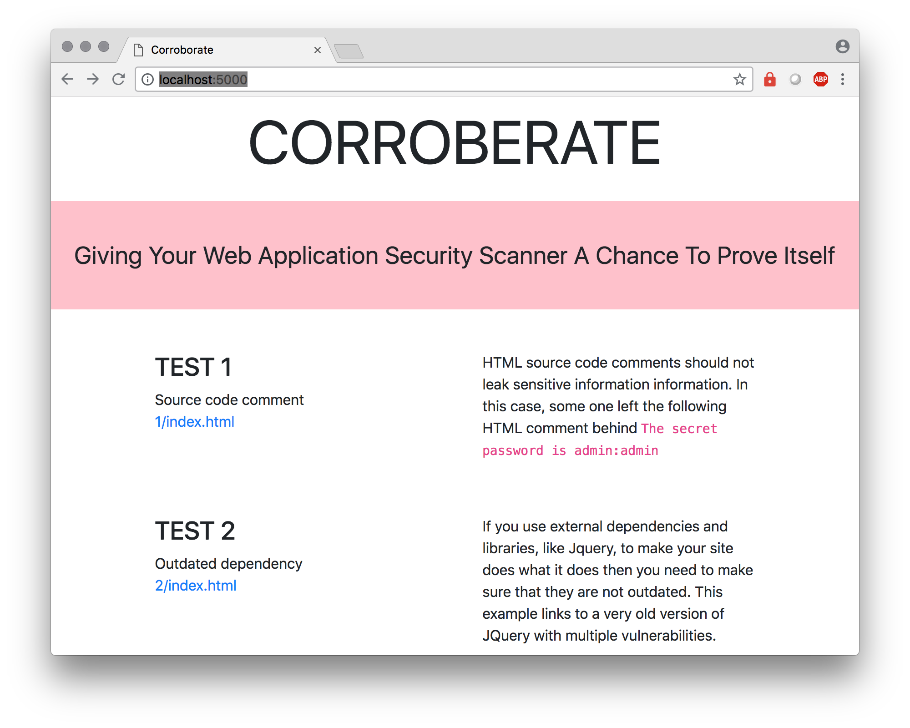

# corroborate
Give any Web Application Security Scanner a run for its money

## What is corroborate
I created corroborate as a testing ground when I was looking to buy a Web Application Security Scanner to scan a number of public website for vulnerabilities.

The core of Corroborate is a security-flawed web app. You can use Corroborate to test if the Web Application Security Scanner you're evaluating is any good.

## List of vulnerabilities
Corroborate currently has the following vulnerabilities

- Outdated libraries
- Sensitive information in source code

## Usage
`export FLASK_APP=corroberate.py`

`python3 corroborate.py`

This will start a server running on port 5000. Now scan away

